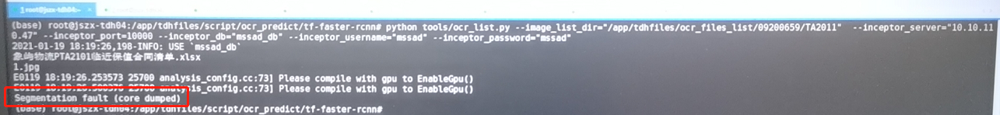
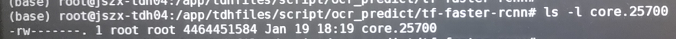
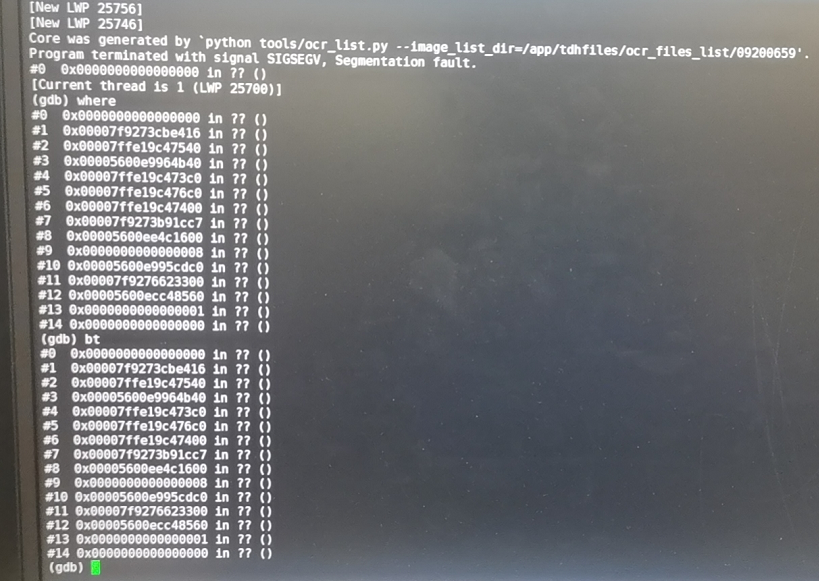
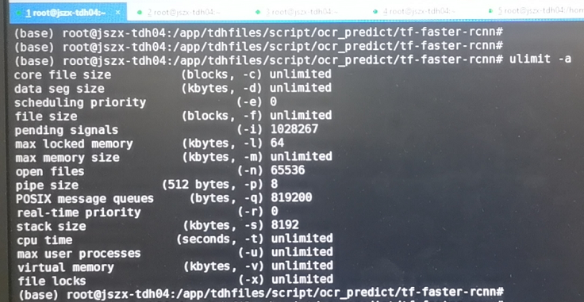
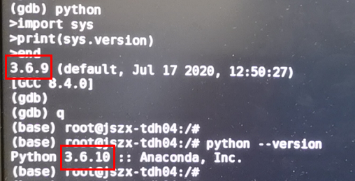
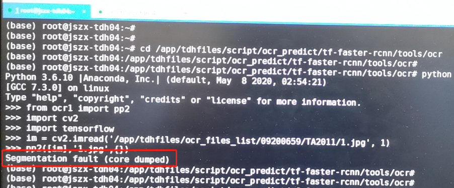
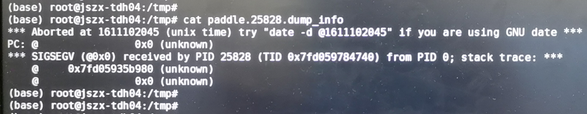
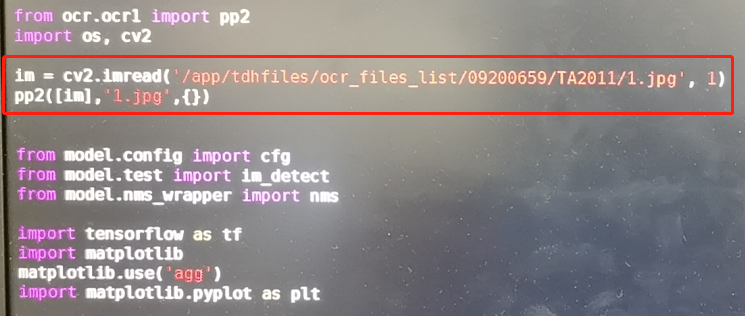

# 环境

| 软件   | 版本  |
| :------- | ---- |
| debian     | 9.4   |
| tensorflow | 1.9.0 |
| GNU GDB | 8.1.1 |
| paddle | 1.7.2 |


# 问题

执行ocr合同清单检测脚本时，报Segmentation fault，见下图：





# 处理过程

## 解析core文件

```shell
gdb -c core.25700
```



* 结论：无明显发现。

## 查看系统资源限制



		* 尝试修改stack大小，无用。
		* 查看程序执行期间操作系统cpu、memory、open files，无异常。


## 尝试gdb调试

​    使用GDB对代码进行调试，但因GDB自带python，并且目前只能通过源码安装时指定python才能修改GDB环境的python，而当前是用apt安装，在内网下载gdb源码安装包不方便。并且在GDB中使用from引入本地python文件时报找不到文件的错误，时间关系，只希望快速解决问题，不想在溯源上花费太多时间。因此暂停调试。

​	GDB执行python：



## 继续定位1

​	继续将范围缩小，确定报错的具体代码。经测试，发现是在执行selft.text_detector(img)时报错，此处的模型是ch_det_r50_vd_db，这是PP的OCR中文检测模型。

​	经多次测试发现，以下代码可以重现问题：

```python
from ocr1 import pp2
import cv2

import tensorflow

im = cv2.imread('/app/tdhfiles/ocr_files_list/09200695/TA2011/1.jpg')
pp2([im], '1.jpg', {})
```



## 继续定位2

​	对复现代码，如果去掉import tensorflow，则代码正常。但是，不清楚import tensorflow对环境具体产生了什么影响，同时在文件中又必须import tensorflow。

​	偶然，在/tmp目录，发现了新日志：



​	看来还是PP模型报的错。

​	以为是时区问题，检查正常。

​	搜索该错误，各种原因。

​	想升级tensorflow，网络问题失败。

​	突然想试下，以下代码会不会报错：先执行pp2，再引入tensorflow，最后再执行一次pp2

```python
from ocr1 import pp2
import cv2

im = cv2.imread('/app/tdhfiles/ocr_files_list/09200695/TA2011/1.jpg')
pp2([im], '1.jpg', {})

import tensorflow

pp2([im], '1.jpg', {})
```

​	发现上述代码不报错：看来和顺序还有一定关系。

​	于是想，如果在源文件中，在import tensorflow前执行一下pp2呢？如下：



​	发现代码可以顺利执行了。


# 解决方法

​	修改demo3.py，在import tensorflow之前，先调用一次pp2方法。

​	

# 结论

​	暂时使用上述workaround方法解决该问题。但是：

1. 问题可能是tensorflow、PP、OS之前存在版本冲突。为什么加入OS？因为在rhel7.4中代码正常。

2. 不知道import tensorflow对环境做了哪些改变。

3. 不清楚import tensorflow与pp2([im], '1.jpg', {})函数间具体冲突是什么，为什么改变先后顺序后可以规避问题。

4. gdb调试应该可以找到更具体的报错代码。

   